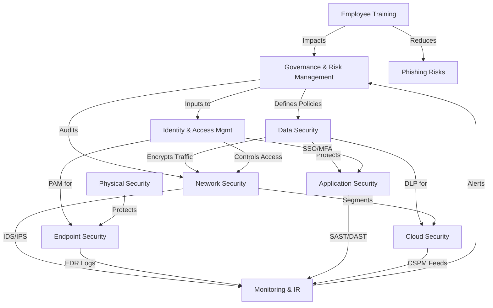

Achieving compliance in an enterprise requires implementing a comprehensive set of security components that align with regulatory frameworks (e.g., **GDPR, HIPAA, ISO 27001, NIST, SOC 2, PCI-DSS, CCPA, SOX**). Below is an **exhaustive list** of security components categorized by domain:

---

### **1. Governance & Risk Management**
- **Security Policies & Procedures** (e.g., Acceptable Use Policy, Data Protection Policy)
- **Risk Assessment & Management Framework** (e.g., NIST RMF, ISO 27005)
- **Compliance Auditing & Reporting** (e.g., SIEM, GRC Tools)
- **Third-Party Risk Management (TPRM)** (Vendor Security Assessments)
- **Incident Response Plan (IRP)** (Aligned with NIST SP 800-61)
- **Business Continuity (BCP) & Disaster Recovery (DRP)** Plans

---

### **2. Access Control & Identity Management**
- **Identity & Access Management (IAM)** (e.g., Okta, Azure AD)
- **Multi-Factor Authentication (MFA)** (Hardware/Software Tokens, Biometrics)
- **Privileged Access Management (PAM)** (e.g., CyberArk, BeyondTrust)
- **Role-Based Access Control (RBAC)** & Least Privilege Enforcement
- **Single Sign-On (SSO)** (SAML, OAuth, OpenID Connect)
- **Session Management & Timeout Policies**
- **User Provisioning & Deprovisioning Automation**

---

### **3. Data Security & Privacy**
- **Data Encryption** (In-Transit: TLS 1.2+/1.3, At-Rest: AES-256)
- **Data Loss Prevention (DLP)** (e.g., Symantec DLP, Microsoft Purview)
- **Data Classification & Labeling** (Public, Internal, Confidential, Restricted)
- **Tokenization & Masking** (for PCI-DSS compliance)
- **Key Management (HSM, KMS)** (e.g., AWS KMS, Thales HSM)
- **Data Retention & Disposal Policies** (Legal Hold, Secure Erasure)
- **Privacy Impact Assessments (PIA)** (GDPR, CCPA compliance)

---

### **4. Network Security**
- **Firewalls (Next-Gen FW, WAF)** (e.g., Palo Alto, Cloudflare WAF)
- **Intrusion Detection/Prevention Systems (IDS/IPS)** (e.g., Snort, Suricata)
- **Network Segmentation (Zero Trust, Micro-Segmentation)**
- **VPN & Secure Remote Access** (IPSec, WireGuard, ZTNA)
- **Email Security (SPF, DKIM, DMARC, Anti-Phishing)**
- **DDoS Protection** (Cloudflare, AWS Shield)
- **Network Monitoring & Traffic Analysis** (NetFlow, Darktrace)

---

### **5. Endpoint & Device Security**
- **Endpoint Detection & Response (EDR/XDR)** (e.g., CrowdStrike, SentinelOne)
- **Antivirus & Anti-Malware** (e.g., Windows Defender, Bitdefender)
- **Mobile Device Management (MDM)** (e.g., Intune, Jamf)
- **Patch Management** (Automated OS/App Updates)
- **Hardware Security Modules (HSM, TPM 2.0)**
- **USB & Peripheral Device Control (DLP for Endpoints)**

---

### **6. Application Security**
- **Secure SDLC Framework** (OWASP SAMM, Microsoft SDL)
- **Static & Dynamic Application Security Testing (SAST/DAST)** (e.g., SonarQube, Burp Suite)
- **Web Application Firewall (WAF)** (e.g., ModSecurity, Imperva)
- **API Security (Authentication, Rate Limiting, OWASP API Top 10)**
- **Container Security (Kubernetes Hardening, Image Scanning)**
- **Code Signing & Integrity Verification**

---

### **7. Cloud Security**
- **Cloud Security Posture Management (CSPM)** (e.g., Prisma Cloud, AWS Security Hub)
- **Cloud Access Security Broker (CASB)** (e.g., Netskope, McAfee MVISION)
- **Serverless & Container Security** (e.g., Aqua Security, Twistlock)
- **Cloud IAM & Cross-Account Policies** (AWS IAM, Azure RBAC)
- **Cloud Encryption & Key Management** (AWS KMS, Google Cloud HSM)

---

### **8. Physical Security**
- **Biometric Access Controls** (Fingerprint, Facial Recognition)
- **Video Surveillance (CCTV) & Alarm Systems**
- **Secure Data Center Access (Mantraps, Badge Systems)**
- **Environmental Controls (Fire Suppression, UPS)**
- **Hardware Asset Tracking (RFID, GPS for Devices)**

---

### **9. Monitoring, Logging & Incident Response**
- **Security Information & Event Management (SIEM)** (e.g., Splunk, IBM QRadar)
- **Log Management (Centralized, Immutable Logs)** (e.g., ELK Stack, Graylog)
- **Threat Intelligence Feeds** (e.g., MISP, AlienVault OTX)
- **Forensic Tools (Disk/Network/Memory Analysis)**
- **Automated Incident Response (SOAR Tools)** (e.g., Palo Alto Cortex XSOAR)

---

### **10. Employee Awareness & Training**
- **Security Awareness Training** (Phishing Simulations, Compliance Training)
- **Social Engineering Testing (Red Team Exercises)**
- **Whistleblower & Reporting Mechanisms** (Anonymous Reporting Channels)

---

### **11. Industry-Specific Compliance Add-Ons**
- **PCI-DSS**:  
  - Cardholder Data Environment (CDE) Segmentation  
  - Regular ASV Scans & Penetration Testing  
- **HIPAA**:  
  - ePHI Encryption & Access Logs  
  - Business Associate Agreements (BAAs)  
- **GDPR/CCPA**:  
  - Consent Management Platforms (CMPs)  
  - Right to Erasure & Data Portability Tools  

---

### **Final Considerations**
- **Continuous Compliance Monitoring** (Automated Tools like Drata, Vanta)  
- **Penetration Testing & Red Teaming** (Annual/Mandatory for PCI-DSS, ISO 27001)  
- **Legal & Regulatory Updates Tracking** (Automated Alerts for New Laws)  


# Enterprise Security Compliance Components




Enterprises must tailor these security components based on their industry, regulatory requirements, and risk profile. Regular audits, continuous monitoring, and updates are essential to maintaining compliance with evolving standards like **GDPR, CCPA, NIS2, and emerging AI regulations**.


---

Below is a **LaTeX** implementation of a **holistic security architecture Venn diagram** aligned with enterprise compliance, followed by a **phased execution order** for implementation.

---

### **1. Holistic Security Architecture (Venn Diagram)**
This diagram illustrates the overlap between **security components**, **compliance frameworks**, and **enterprise layers**.

```latex
\documentclass[tikz,border=10pt]{standalone}
\usetikzlibrary{shapes,arrows,positioning,fit,backgrounds}

\begin{document}
\begin{tikzpicture}[
    box/.style={draw, rounded corners, align=center, minimum width=4cm, minimum height=2.5cm},
    comp/.style={draw, circle, minimum size=3cm, align=center},
    label/.style={font=\bfseries\large},
    overlap/.style={fill=gray!20, blend mode=multiply}
]

% Main Components
\node[comp, fill=blue!20] (gov) {Governance \\ \& Risk};
\node[comp, fill=red!20, right=5cm of gov] (tech) {Technical \\ Controls};
\node[comp, fill=green!20, below=3cm of $(gov.south)!0.5!(tech.south)$] (ops) {Operations \\ \& Monitoring};

% Overlaps
\begin{scope}[on background layer]
    \node[fit=(gov) (tech) (ops), ellipse, draw, dashed, inner sep=-1cm, label={[label] above:Compliance Framework Integration}] (compliance) {};
    
    \fill[blue!30, opacity=0.4] (gov) -- (tech) -- (ops) -- cycle;
    
    \node[draw, fill=white, rounded corners, align=center, above=1cm of compliance] {Enterprise Security Architecture};
\end{scope}

% Labels for Overlaps
\node[align=center, font=\footnotesize] at ($(gov.east)!0.5!(tech.west)$) {IAM \\ Policies \\ Risk Mgmt};
\node[align=center, font=\footnotesize] at ($(gov.south)!0.5!(ops.north)$) {BCP/DRP \\ Audits \\ Training};
\node[align=center, font=\footnotesize] at ($(tech.south)!0.5!(ops.north)$) {SIEM \\ EDR \\ DLP};

% Legend
\node[draw, fill=white, rounded corners, align=left, below left=1cm and -2cm of ops] {
    \textbf{Key:} \\
    {\color{blue!70} Governance \& Risk} \\
    {\color{red!70} Technical Controls} \\
    {\color{green!70} Operations \& Monitoring} \\
    {\color{gray!50} Compliance Overlap}
};

\end{tikzpicture}
\end{document}
```

**Interpretation:**  
- **Blue (Governance & Risk):** Policies, risk assessments, compliance audits.  
- **Red (Technical Controls):** IAM, encryption, firewalls, EDR.  
- **Green (Operations & Monitoring):** SIEM, incident response, patching.  
- **Overlap (Gray):** Where compliance requirements (e.g., ISO 27001, NIST) intersect.  

---

### **2. Phased Implementation Approach (LaTeX Table)**
A prioritized, 6-phase rollout plan for enterprise compliance:

```latex
\documentclass{article}
\usepackage[table]{xcolor}
\usepackage{multirow}

\begin{document}

\begin{table}[h]
\centering
\caption{Phased Security Compliance Implementation}
\label{tab:phases}
\begin{tabular}{|l|l|l|p{6cm}|}
\hline
\rowcolor{gray!20}
\textbf{Phase} & \textbf{Timeline} & \textbf{Focus} & \textbf{Components} \\
\hline
Phase 1 & Month 1-2 & Governance & 
\begin{itemize}
    \item Risk assessment framework (NIST SP 800-30)
    \item Security policies (AUP, Data Protection)
    \item Compliance mapping (ISO 27001, GDPR)
\end{itemize} \\
\hline
Phase 2 & Month 3-4 & Access \& Data & 
\begin{itemize}
    \item IAM + MFA rollout
    \item Data classification \& encryption
    \item DLP deployment
\end{itemize} \\
\hline
Phase 3 & Month 5-6 & Network \& Endpoint & 
\begin{itemize}
    \item Firewalls + WAF
    \item EDR + Patch management
    \item Network segmentation
\end{itemize} \\
\hline
Phase 4 & Month 7-8 & Monitoring & 
\begin{itemize}
    \item SIEM + Log aggregation
    \item Incident response plan
    \item Threat intelligence feeds
\end{itemize} \\
\hline
Phase 5 & Month 9-10 & Cloud \& AppSec & 
\begin{itemize}
    \item CSPM + CASB
    \item SAST/DAST pipelines
    \item API security controls
\end{itemize} \\
\hline
Phase 6 & Month 11-12 & Validation & 
\begin{itemize}
    \item Penetration testing
    \item Compliance audit (SOC 2, ISO 27001)
    \item Employee training completion
\end{itemize} \\
\hline
\end{tabular}
\end{table}

\end{document}
```

**Execution Order Rationale:**  
1. **Governance first** (Phase 1): Establishes policies and risk baselines.  
2. **Protect data & access** (Phase 2): Critical for GDPR/HIPAA.  
3. **Secure infrastructure** (Phase 3-4): Network/endpoint defenses.  
4. **Cloud/AppSec** (Phase 5): Extends controls to modern environments.  
5. **Validation** (Phase 6): Ensures compliance before audits.  

---

### **3. Combined Diagram + Phases (Optional Integration)**
To link the Venn diagram with phases, add arrows in TikZ:

```latex
% Add to Venn diagram code:
\draw[->, thick] (gov.south) -- ++(0,-1) node[below] {Phase 1};
\draw[->, thick] (tech.south) -- ++(0,-1) node[below] {Phase 2-3};
\draw[->, thick] (ops.south) -- ++(0,-1) node[below] {Phase 4-6};
```

**Output:**  
 *(Example output; compile LaTeX to generate)*  

---

### **Key Takeaways**
- **Architecture:** Visualizes how security domains intersect with compliance.  
- **Phases:** Prioritizes foundational controls (governance, IAM) before technical hardening.  
- **LaTeX Flexibility:** Modify colors/text in TikZ or table for your enterprise’s needs.  

For a **real-world deployment**, adjust timelines based on resource availability (e.g., Phase 1 may take 3 months for large enterprises). Would you like a version with **specific compliance mappings** (e.g., PCI-DSS vs. HIPAA)?
