To ensure compliance with industry standards, regulations, and best practices, enterprises must implement a comprehensive set of security components. Below is a categorized list of essential security components required for compliance:

### **1. Governance & Risk Management**
   - **Security Policies & Procedures** (e.g., Acceptable Use Policy, Data Protection Policy)
   - **Risk Assessment & Management Framework** (e.g., NIST, ISO 27005)
   - **Compliance Audits & Reporting** (e.g., SOC 2, PCI-DSS, HIPAA, GDPR)
   - **Third-Party Vendor Risk Management**
   - **Incident Response Plan (IRP) & Business Continuity Plan (BCP)**

### **2. Identity & Access Management (IAM)**
   - **Multi-Factor Authentication (MFA)**
   - **Single Sign-On (SSO)**
   - **Role-Based Access Control (RBAC)**
   - **Privileged Access Management (PAM)**
   - **Identity Governance & Administration (IGA)**
   - **Password Management & Encryption**

### **3. Data Protection & Privacy**
   - **Data Encryption (At Rest, In Transit, In Use)**
   - **Data Loss Prevention (DLP)**
   - **Data Classification & Handling Policies**
   - **Tokenization & Masking (for PCI-DSS, GDPR)**
   - **Key Management System (KMS)**
   - **Backup & Disaster Recovery Solutions**

### **4. Network Security**
   - **Firewalls (Next-Gen Firewalls, WAF)**
   - **Intrusion Detection & Prevention Systems (IDS/IPS)**
   - **Network Segmentation & Zero Trust Architecture**
   - **VPN & Secure Remote Access**
   - **Email Security (Anti-Phishing, DMARC, DKIM, SPF)**
   - **DDoS Protection**

### **5. Endpoint & Device Security**
   - **Endpoint Detection & Response (EDR/XDR)**
   - **Mobile Device Management (MDM)**
   - **Patch Management & Vulnerability Scanning**
   - **Antivirus & Anti-Malware Solutions**
   - **Hardware Security Modules (HSM) for Critical Systems**

### **6. Application Security**
   - **Secure Software Development Lifecycle (SDLC)**
   - **Static & Dynamic Application Security Testing (SAST/DAST)**
   - **Web Application Firewall (WAF)**
   - **API Security & OAuth 2.0**
   - **Container & Cloud-Native Security (CNAPP, CSPM)**

### **7. Monitoring & Logging**
   - **Security Information & Event Management (SIEM)**
   - **Log Management & Retention Policies**
   - **User & Entity Behavior Analytics (UEBA)**
   - **Threat Intelligence & Hunting**
   - **Real-Time Alerts & Automated Response (SOAR)**

### **8. Physical Security**
   - **Biometric Access Controls**
   - **Surveillance (CCTV) & Alarm Systems**
   - **Secure Data Center & Server Room Policies**
   - **Environmental Controls (Fire Suppression, UPS)**

### **9. Compliance-Specific Requirements**
   - **GDPR** (Data Subject Rights, Privacy by Design)
   - **HIPAA** (PHI Protection, Audit Logs)
   - **PCI-DSS** (Cardholder Data Protection, Regular Scans)
   - **SOC 2** (Trust Services Criteria - Security, Availability, Confidentiality)
   - **ISO 27001** (ISMS Implementation)
   - **NIST CSF / NIST 800-53** (Cybersecurity Framework)

### **10. Employee Awareness & Training**
   - **Security Awareness Programs**
   - **Phishing Simulation Exercises**
   - **Compliance Training (GDPR, HIPAA, etc.)**
   - **Whistleblower & Reporting Mechanisms**

# Enterprise Security Compliance Components

```mermaid
graph TD
    A[Enterprise Security Compliance] --> B[Governance & Risk Management]
    A --> C[Identity & Access Management]
    A --> D[Data Protection & Privacy]
    A --> E[Network Security]
    A --> F[Endpoint & Device Security]
    A --> G[Application Security]
    A --> H[Monitoring & Logging]
    A --> I[Physical Security]
    A --> J[Compliance-Specific]
    A --> K[Employee Awareness]

    B --> B1[Security Policies]
    B --> B2[Risk Assessments]
    B --> B3[Incident Response Plan]

    C --> C1[MFA/SSO]
    C --> C2[RBAC/PAM]
    C --> C3[Identity Governance]

    D --> D1[Encryption]
    D --> D2[DLP]
    D --> D3[Backup & Recovery]

    E --> E1[Firewalls]
    E --> E2[IDS/IPS]
    E --> E3[Zero Trust]

    F --> F1[EDR/XDR]
    F --> F2[Patch Management]
    F --> F3[Antivirus]

    G --> G1[SAST/DAST]
    G --> G2[WAF]
    G --> G3[API Security]

    H --> H1[SIEM]
    H --> H2[UEBA]
    H --> H3[Threat Hunting]

    I --> I1[Biometric Access]
    I --> I2[CCTV]
    I --> I3[Secure Data Centers]

    J --> J1[GDPR]
    J --> J2[HIPAA]
    J --> J3[PCI-DSS]

    K --> K1[Security Training]
    K --> K2[Phishing Simulations]
    K --> K3[Compliance Workshops]

```

Enterprises must tailor these security components based on their industry, regulatory requirements, and risk profile. Regular audits, continuous monitoring, and updates are essential to maintaining compliance with evolving standards like **GDPR, CCPA, NIS2, and emerging AI regulations**.

