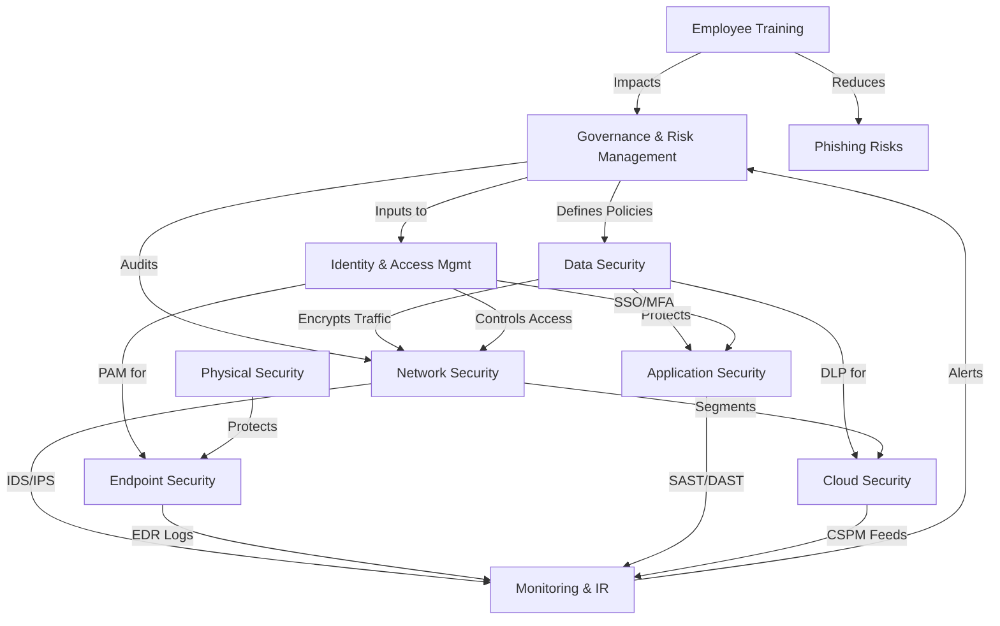

Achieving compliance in an enterprise requires implementing a comprehensive set of security components that align with regulatory frameworks (e.g., **GDPR, HIPAA, ISO 27001, NIST, SOC 2, PCI-DSS, CCPA, SOX**). Below is an **exhaustive list** of security components categorized by domain:

---

### **1. Governance & Risk Management**
- **Security Policies & Procedures** (e.g., Acceptable Use Policy, Data Protection Policy)
- **Risk Assessment & Management Framework** (e.g., NIST RMF, ISO 27005)
- **Compliance Auditing & Reporting** (e.g., SIEM, GRC Tools)
- **Third-Party Risk Management (TPRM)** (Vendor Security Assessments)
- **Incident Response Plan (IRP)** (Aligned with NIST SP 800-61)
- **Business Continuity (BCP) & Disaster Recovery (DRP)** Plans

---

### **2. Access Control & Identity Management**
- **Identity & Access Management (IAM)** (e.g., Okta, Azure AD)
- **Multi-Factor Authentication (MFA)** (Hardware/Software Tokens, Biometrics)
- **Privileged Access Management (PAM)** (e.g., CyberArk, BeyondTrust)
- **Role-Based Access Control (RBAC)** & Least Privilege Enforcement
- **Single Sign-On (SSO)** (SAML, OAuth, OpenID Connect)
- **Session Management & Timeout Policies**
- **User Provisioning & Deprovisioning Automation**

---

### **3. Data Security & Privacy**
- **Data Encryption** (In-Transit: TLS 1.2+/1.3, At-Rest: AES-256)
- **Data Loss Prevention (DLP)** (e.g., Symantec DLP, Microsoft Purview)
- **Data Classification & Labeling** (Public, Internal, Confidential, Restricted)
- **Tokenization & Masking** (for PCI-DSS compliance)
- **Key Management (HSM, KMS)** (e.g., AWS KMS, Thales HSM)
- **Data Retention & Disposal Policies** (Legal Hold, Secure Erasure)
- **Privacy Impact Assessments (PIA)** (GDPR, CCPA compliance)

---

### **4. Network Security**
- **Firewalls (Next-Gen FW, WAF)** (e.g., Palo Alto, Cloudflare WAF)
- **Intrusion Detection/Prevention Systems (IDS/IPS)** (e.g., Snort, Suricata)
- **Network Segmentation (Zero Trust, Micro-Segmentation)**
- **VPN & Secure Remote Access** (IPSec, WireGuard, ZTNA)
- **Email Security (SPF, DKIM, DMARC, Anti-Phishing)**
- **DDoS Protection** (Cloudflare, AWS Shield)
- **Network Monitoring & Traffic Analysis** (NetFlow, Darktrace)

---

### **5. Endpoint & Device Security**
- **Endpoint Detection & Response (EDR/XDR)** (e.g., CrowdStrike, SentinelOne)
- **Antivirus & Anti-Malware** (e.g., Windows Defender, Bitdefender)
- **Mobile Device Management (MDM)** (e.g., Intune, Jamf)
- **Patch Management** (Automated OS/App Updates)
- **Hardware Security Modules (HSM, TPM 2.0)**
- **USB & Peripheral Device Control (DLP for Endpoints)**

---

### **6. Application Security**
- **Secure SDLC Framework** (OWASP SAMM, Microsoft SDL)
- **Static & Dynamic Application Security Testing (SAST/DAST)** (e.g., SonarQube, Burp Suite)
- **Web Application Firewall (WAF)** (e.g., ModSecurity, Imperva)
- **API Security (Authentication, Rate Limiting, OWASP API Top 10)**
- **Container Security (Kubernetes Hardening, Image Scanning)**
- **Code Signing & Integrity Verification**

---

### **7. Cloud Security**
- **Cloud Security Posture Management (CSPM)** (e.g., Prisma Cloud, AWS Security Hub)
- **Cloud Access Security Broker (CASB)** (e.g., Netskope, McAfee MVISION)
- **Serverless & Container Security** (e.g., Aqua Security, Twistlock)
- **Cloud IAM & Cross-Account Policies** (AWS IAM, Azure RBAC)
- **Cloud Encryption & Key Management** (AWS KMS, Google Cloud HSM)

---

### **8. Physical Security**
- **Biometric Access Controls** (Fingerprint, Facial Recognition)
- **Video Surveillance (CCTV) & Alarm Systems**
- **Secure Data Center Access (Mantraps, Badge Systems)**
- **Environmental Controls (Fire Suppression, UPS)**
- **Hardware Asset Tracking (RFID, GPS for Devices)**

---

### **9. Monitoring, Logging & Incident Response**
- **Security Information & Event Management (SIEM)** (e.g., Splunk, IBM QRadar)
- **Log Management (Centralized, Immutable Logs)** (e.g., ELK Stack, Graylog)
- **Threat Intelligence Feeds** (e.g., MISP, AlienVault OTX)
- **Forensic Tools (Disk/Network/Memory Analysis)**
- **Automated Incident Response (SOAR Tools)** (e.g., Palo Alto Cortex XSOAR)

---

### **10. Employee Awareness & Training**
- **Security Awareness Training** (Phishing Simulations, Compliance Training)
- **Social Engineering Testing (Red Team Exercises)**
- **Whistleblower & Reporting Mechanisms** (Anonymous Reporting Channels)

---

### **11. Industry-Specific Compliance Add-Ons**
- **PCI-DSS**:  
  - Cardholder Data Environment (CDE) Segmentation  
  - Regular ASV Scans & Penetration Testing  
- **HIPAA**:  
  - ePHI Encryption & Access Logs  
  - Business Associate Agreements (BAAs)  
- **GDPR/CCPA**:  
  - Consent Management Platforms (CMPs)  
  - Right to Erasure & Data Portability Tools  

---

### **Final Considerations**
- **Continuous Compliance Monitoring** (Automated Tools like Drata, Vanta)  
- **Penetration Testing & Red Teaming** (Annual/Mandatory for PCI-DSS, ISO 27001)  
- **Legal & Regulatory Updates Tracking** (Automated Alerts for New Laws)  


# Enterprise Security Compliance Components




Enterprises must tailor these security components based on their industry, regulatory requirements, and risk profile. Regular audits, continuous monitoring, and updates are essential to maintaining compliance with evolving standards like **GDPR, CCPA, NIS2, and emerging AI regulations**.

```plantuml
@startuml Enterprise Security Architecture - Compliance Venn Diagram

!define Compliance #FFD700
!define Governance #87CEEB
!define DataSecurity #98FB98
!define AccessControl #FFA07A
!define NetworkSecurity #FFB6C1
!define AppSecurity #DDA0DD
!define CloudSecurity #FF6347
!define PhysicalSecurity #B0E0E6
!define Monitoring #FF8C00

title Holistic Security Architecture (Compliance-Aligned)

circle Compliance <<Compliance>> #FFD700
circle Governance <<Governance & Risk>> #87CEEB
circle DataSecurity <<Data Security & Privacy>> #98FB98
circle AccessControl <<IAM & PAM>> #FFA07A
circle NetworkSecurity <<Network Protection>> #FFB6C1
circle AppSecurity <<App & API Security>> #DDA0DD
circle CloudSecurity <<Cloud & Hybrid>> #FF6347
circle PhysicalSecurity <<Physical & Environmental>> #B0E0E6
circle Monitoring <<SIEM & IR>> #FF8C00

Compliance -[hidden]-> Governance
Compliance -[hidden]-> DataSecurity
Compliance -[hidden]-> AccessControl
Compliance -[hidden]-> NetworkSecurity
Compliance -[hidden]-> AppSecurity
Compliance -[hidden]-> CloudSecurity
Compliance -[hidden]-> PhysicalSecurity
Compliance -[hidden]-> Monitoring

Governance .u.> Compliance : Policies & Audits
DataSecurity .u.> Compliance : Encryption & DLP
AccessControl .u.> Compliance : RBAC/MFA
NetworkSecurity .u.> Compliance : Firewalls/IDS
AppSecurity .u.> Compliance : SAST/DAST
CloudSecurity .u.> Compliance : CSPM/CASB
PhysicalSecurity .u.> Compliance : Biometrics
Monitoring .u.> Compliance : SIEM/SOC

note right of Compliance
  Aligns with:
  - ISO 27001
  - NIST CSF
  - GDPR/HIPAA
  - PCI-DSS/SOC 2
end note

@enduml
```
