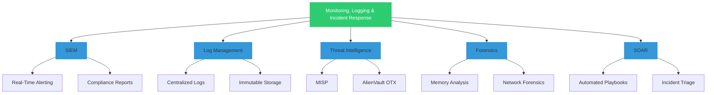
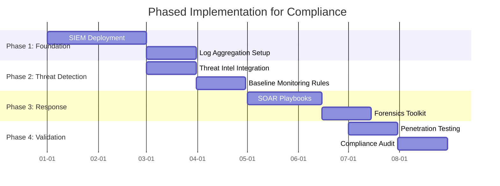
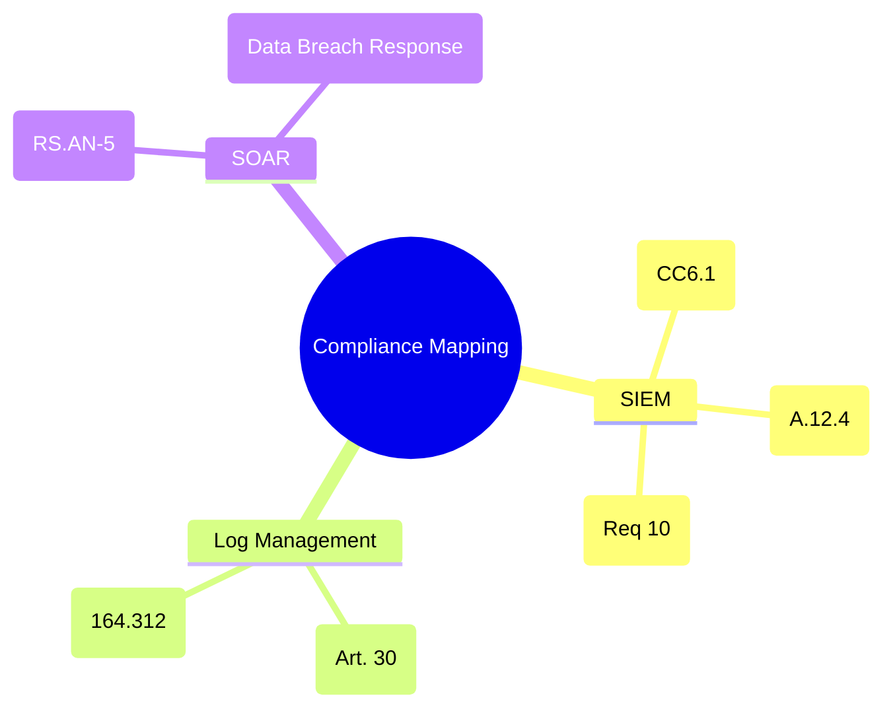

Here’s a **focused breakdown** of **Monitoring, Logging & Incident Response** components required for enterprise compliance, aligned with major regulatory frameworks (e.g., **NIST, ISO 27001, GDPR, HIPAA, PCI-DSS, SOC 2**), followed by a **phased implementation plan**.

---

### **1. Compliance-Aligned Monitoring, Logging & Incident Response Components**
#### **A. Logging Requirements**
| **Component**               | **Regulatory Alignment**                                                                 | **Tools/Examples**                          |
|------------------------------|------------------------------------------------------------------------------------------|---------------------------------------------|
| **Centralized Logging**      | ISO 27001 (A.12.4), NIST SP 800-53 (AU-4), PCI-DSS (Req 10)                              | ELK Stack, Splunk, Graylog                 |
| **Immutable Logs**           | PCI-DSS (Req 10.5.1), GDPR (Art. 32), HIPAA (164.312(b))                                 | AWS CloudTrail + S3 Lock, Wazuh            |
| **Audit Trail Retention**    | SOX (6+ years), HIPAA (6 years), GDPR (Art. 30)                                          | Azure Sentinel, Google Chronicle            |
| **User Activity Logging**    | NIST (AU-2), ISO 27001 (A.12.4), SOC 2 (CC6.1)                                          | Okta System Log, CrowdStrike Falcon        |

#### **B. Monitoring Requirements**
| **Component**               | **Regulatory Alignment**                                                                 | **Tools/Examples**                          |
|------------------------------|------------------------------------------------------------------------------------------|---------------------------------------------|
| **SIEM (Real-time Monitoring)** | NIST SP 800-137, ISO 27001 (A.12.4), PCI-DSS (Req 10.6)                               | IBM QRadar, Microsoft Sentinel              |
| **UEBA (User Behavior Analytics)** | GDPR (Art. 32), HIPAA (164.308(a)(1)(ii)(D))                                         | Exabeam, Darktrace                          |
| **File Integrity Monitoring (FIM)** | PCI-DSS (Req 11.5), NIST (SI-7)                                                      | OSSEC, Tripwire                             |
| **Endpoint Detection & Response (EDR)** | HIPAA (164.308(a)(6)), NIST CSF (DE.CM-4)                                            | CrowdStrike, SentinelOne                    |

#### **C. Incident Response Requirements**
| **Component**               | **Regulatory Alignment**                                                                 | **Tools/Examples**                          |
|------------------------------|------------------------------------------------------------------------------------------|---------------------------------------------|
| **Incident Response Plan (IRP)** | NIST SP 800-61, ISO 27001 (A.16.1), HIPAA (164.308(a)(6))                              | PagerDuty, Swimlane                         |
| **Automated Response (SOAR)** | NIST CSF (RS.RP-1), PCI-DSS (Req 12.10)                                               | Palo Alto Cortex XSOAR, Splunk Phantom      |
| **Forensic Readiness**       | GDPR (Art. 33), PCI-DSS (Req 12.10)                                                     | FTK Imager, Volatility                      |
| **Breach Notification Process** | GDPR (72h), CCPA (45 days), HIPAA (60 days)                                           | OneTrust, TrustArc                          |

---

### **2. Phased Implementation for Monitoring, Logging & IR Compliance**  

| **Phase**  | **Timeline** | **Focus**               | **Key Actions** |
|------------|-------------|-------------------------|----------------|
| **Phase 1** | Month 1-2   | Logging Foundation      | • Deploy centralized logging (e.g., ELK/Splunk)   • Enable audit trails for critical systems (AD, DBs)   • Define retention policies (align with GDPR/PCI) |
| **Phase 2** | Month 3-4   | Real-time Monitoring    | • Implement SIEM (e.g., Sentinel, QRadar)   • Configure alerts for compliance violations (e.g., failed logins)   • Integrate threat intelligence feeds (MISP) |
| **Phase 3** | Month 5-6   | Incident Readiness      | • Document IRP (NIST 800-61 template)   • Conduct tabletop exercises (HIPAA/SOC 2)   • Deploy SOAR for automated playbooks |
| **Phase 4** | Month 7-8   | Advanced Controls       | • Roll out UEBA/FIM (e.g., Darktrace, OSSEC)   • Encrypt logs + immutable storage (PCI 10.5)   • Test forensic tools (FTK, Volatility) |
| **Phase 5** | Month 9-12  | Continuous Compliance   | • Automate compliance reports (e.g., Drata)   • Annual pentesting + IR drill (PCI 11.3)   • Update IRP post-audit findings |

---

**Key Compliance Drivers per Phase:**  
- **Phase 1:** GDPR (Art. 30), PCI-DSS (Req 10)  
- **Phase 2:** NIST SP 800-137, ISO 27001 (A.12.4)  
- **Phase 3:** HIPAA (164.308(a)(6)), SOC 2 (CC7.2)  
- **Phase 4:** PCI-DSS (Req 11.5), CCPA (Sec 1798.150)  
- **Phase 5:** SOX (302/404), ISO 27001 (A.18.2)  

---

### 3. Compliance Overlap 

Monitoring, Logging & Incident Response** components for enterprise compliance, followed by a **phased implementation plan**.  

---

### **3.1. Compliance-Aligned Monitoring, Logging & Incident Response (Mermaid)**  

**Key Components:**  
- **SIEM (Splunk, QRadar):** Real-time alerts + compliance reports (e.g., SOC 2, ISO 27001).  
- **Log Management (ELK, Graylog):** Centralized, tamper-proof logs for audits.  
- **Threat Intelligence (MISP):** Proactive threat detection.  
- **Forensics (FTK, Volatility):** Post-incident analysis.  
- **SOAR (Cortex XSOAR):** Automated incident response.  

---

### **3.2. Phased Implementation Plan (Mermaid Gantt Chart)**  

**Phases Explained:**  
1. **Phase 1 (Foundation):**  
   - Deploy SIEM (e.g., Splunk) for centralized monitoring.  
   - Set up log aggregation (e.g., AWS CloudTrail + ELK).  
2. **Phase 2 (Threat Detection):**  
   - Integrate threat feeds (e.g., MISP for GDPR/NIST).  
   - Define baseline correlation rules (e.g., brute-force attacks).  
3. **Phase 3 (Response):**  
   - Automate IR with SOAR (e.g., quarantine compromised devices).  
   - Deploy forensics tools (e.g., Volatility for malware analysis).  
4. **Phase 4 (Validation):**  
   - Pen-testing (PCI-DSS Requirement 11.3).  
   - Final audit (e.g., ISO 27001 certification).  

---

### **3.3. Compliance Mapping (Mermaid Mind Map)**  

**Regulatory Alignment:**  
- **SIEM:** PCI-DSS (Requirement 10), ISO 27001 (A.12.4).  
- **Logs:** GDPR (Article 30), HIPAA (164.312).  
- **SOAR:** NIST CSF (Respond Function).  

---

### **Key Takeaways**  
1. **Start with SIEM/Logs** to meet most compliance requirements (e.g., PCI-DSS, HIPAA).  
2. **Automate response (SOAR)** for frameworks like NIST CSF.  
3. **Validate annually** with pentests/audits.  

**Example Tools by Phase:**  
| Phase       | Tools                          | Compliance Target       |  
|-------------|-------------------------------|------------------------|  
| 1           | Splunk, ELK                   | SOC 2, ISO 27001       |  
| 2           | MISP, AlienVault              | NIST SP 800-53         |  
| 3           | Cortex XSOAR, Volatility      | GDPR Art. 33           |  
  

---

### **4. Critical Compliance Checklists**
#### **GDPR (Art. 32, 33)**  
- [x] Log access to personal data (Art. 30)  
- [x] 72-hour breach notification process  

#### **PCI-DSS (Req 10, 11, 12)**  
- [x] Daily log reviews (Req 10.6)  
- [x] FIM for critical files (Req 11.5)  

#### **HIPAA (164.308, 164.312)**  
- [x] Audit logs for ePHI access (164.312(b))  
- [x] IRP with annual testing (164.308(a)(6))  

---

### **5. Execution Recommendations**  
1. **Start with Phase 1 (Logging):** Without logs, compliance evidence is impossible.  
2. **Automate Monitoring (Phase 2):** Reduces manual effort for PCI/NIST.  
3. **Test IRP Early (Phase 3):** Avoid "paper compliance" failures during audits.  
4. **Immutable Logs (Phase 4):** Critical for PCI-DSS 10.5.1 and legal defensibility.  
