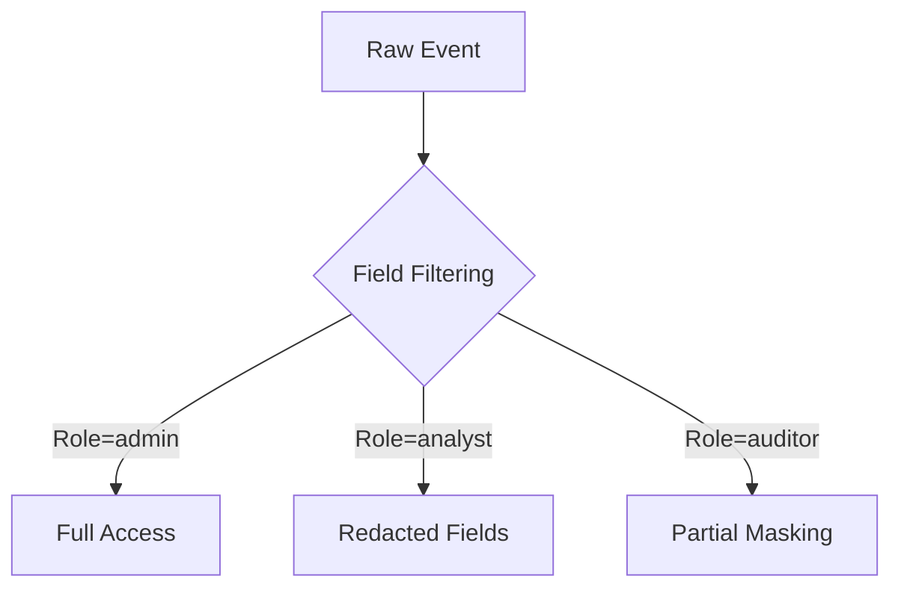

##  **Splunk Authorization**, covering both configuration and implementation details:

---

## **Splunk Authorization: Core Concepts**

### **1. Authorization Components**
| Component | Description | Config File Location |
|-----------|-------------|----------------------|
| **Roles** | Permission groups | `$SPLUNK_HOME/etc/system/local/authorize.conf` |
| **Capabilities** | Granular permissions | `$SPLUNK_HOME/etc/system/local/authorize.conf` |
| **Index-based Access** | Data segmentation | `$SPLUNK_HOME/etc/system/local/authorize.conf` |
| **App Contexts** | UI restrictions | `$SPLUNK_HOME/etc/apps/<app>/local/authorize.conf` |

---

## **2. Role Configuration**
### **Basic Role Definition**
```ini
# $SPLUNK_HOME/etc/system/local/authorize.conf
[role_analyst]
importRoles = user
srchIndexesAllowed = main,security
srchDiskQuota = 100
rtSrchJobsQuota = 5
capabilities = schedule_search,search
```

### **Common Built-in Roles**
| Role | Capabilities |
|------|-------------|
| **admin** | Full system access |
| **power** | Advanced search capabilities |
| **user** | Basic search access |
| **can_delete** | Delete event permissions |

---

## **3. Capabilities Management**
### **Key Capabilities**
```ini
# Sample capabilities addition
[role_soc]
capabilities = edit_own_alerts, list_forwarders, output_file
```

### **Critical Security Capabilities**
| Capability | Risk Level | Recommendation |
|------------|-----------|----------------|
| `admin_all_objects` | High | Restrict to admins only |
| `edit_user` | Medium | Limit to HR/security teams |
| `restart_splunkd` | High | Require MFA |

---

## **4. Index-Based Authorization**
### **Data Segmentation**
```ini
[role_hr]
srchIndexesAllowed = hr_data
srchIndexesDefault = hr_data
```

### **Cross-Index Restrictions**
```ini
[role_auditor]
srchIndexesAllowed = *
srchIndexesDefault = audit_logs
```

---

## **5. CLI Commands for Authorization**
### **Role Management**
```bash
# Create role
splunk add role soc_analyst -imported-user -srch-indexes-allowed main,security -capabilities schedule_search

# List roles
splunk list roles

# Assign user to role
splunk edit user jsmith -roles power,soc_analyst -auth admin:<password>
```

### **Capability Management**
```bash
# Add capability to role
splunk edit role soc_analyst -add-capability output_file -auth admin:<password>

# Remove capability
splunk edit role soc_analyst -remove-capability edit_user -auth admin:<password>
```

---

## **6. Best Practices for Authorization**
1. **Principle of Least Privilege**
   ```ini
   [role_developer]
   srchIndexesAllowed = dev_*
   capabilities = edit_own_alerts
   ```

2. **Regular Audits**
   ```bash
   # Find users with admin privileges
   grep -r "importRoles = admin" $SPLUNK_HOME/etc/
   ```

3. **Role Templates**
   ```ini
   [role_template]
   srchDiskQuota = 50
   rtSrchJobsQuota = 3
   ```

4. **App-Specific Contexts**
   ```ini
   # In app/local/authorize.conf
   [role_es_user]
   importRoles = user
   capabilities = ess_admin
   ```

---

## **7. Troubleshooting Authorization**
### **Common Issues**
| Symptom | Diagnostic Command | Solution |
|---------|--------------------|----------|
| Permission denied | `splunk btool authorize list role=<role> --debug` | Verify role capabilities |
| Missing indexes | `splunk list indexes -auth <user>:<password>` | Check `srchIndexesAllowed` |
| UI elements hidden | `grep "hide" $SPLUNK_HOME/etc/apps/*/local/ui-prefs.conf` | Review app contexts |

### **Debugging Tools**
```bash
# Check effective permissions
splunk show user-permissions <username> -auth admin:<password>

# Verify config precedence
splunk btool authorize list --debug
```

---

## **8. Advanced Authorization Scenarios**
### **Multi-Tenancy Setup**
```ini
[role_tenant1_admin]
importRoles = admin
srchIndexesAllowed = tenant1_*
capabilities = edit_user : tenant1_*
```

### **Time-Based Restrictions**
```ini
[role_night_auditor]
importRoles = auditor
capabilities = search
srchTimeWin = 60
```

### **Custom Capabilities**
```ini
[capability::custom_export]
description = Allow CSV exports
commands = exporttool
```

---

## **Authorization Hardening Checklist**
1. [ ] Disable default `admin` account
2. [ ] Implement role expiration (via scripts)
3. [ ] Enable audit logging for role changes
4. [ ] Regular review of `authorize.conf` backups
5. [ ] Separate duties between:
   - Search users
   - Alert creators
   - User managers
   - System administrators

---

## **Key Files Backup**
```bash
# Critical authorization files
tar -czvf splunk_auth_backup.tar.gz \
$SPLUNK_HOME/etc/system/local/authorize.conf \
$SPLUNK_HOME/etc/passwd \
$SPLUNK_HOME/etc/apps/*/local/authorize.conf
```
----
---
---

## **Splunk Roles and Capabilities** with their associated permissions:

---

### **1. Default Splunk Roles**
| Role | Description | Inherits From |
|------|-------------|---------------|
| **admin** | Full system access | - |
| **power** | Advanced search capabilities | user |
| **user** | Basic search functionality | - |
| **can_delete** | Delete event permissions | user |
| **sc_admin** | Splunk Cloud admin | admin |
| **sc_analyst** | Splunk Cloud analyst | power |
| **sc_contributor** | Splunk Cloud contributor | user |
| **itsi_admin** | IT Service Intelligence admin | admin |
| **es_admin** | Enterprise Security admin | admin |
| **es_analyst** | Enterprise Security analyst | power |

---

### **2. Complete Capabilities List**
#### **System Administration**
| Capability | Description |
|------------|-------------|
| `admin_all_objects` | Full system configuration access |
| `change_authentication` | Modify authentication settings |
| `change_own_password` | Change own password |
| `edit_deployment_client` | Manage forwarders |
| `edit_deployment_server` | Configure deployment server |
| `edit_forwarders` | Manage forwarding |
| `edit_httpauths` | Configure HTTP auth |
| `edit_input_defaults` | Modify input settings |
| `edit_monitor` | Configure file monitoring |
| `edit_roles` | Create/modify roles |
| `edit_server` | Edit server settings |
| `edit_splunktcp` | Configure TCP inputs |
| `edit_splunktcp_ssl` | Configure SSL TCP inputs |
| `edit_tcp` | Configure raw TCP inputs |
| `edit_udp` | Configure UDP inputs |
| `edit_user` | Manage user accounts |
| `edit_web_settings` | Modify web UI settings |
| `license_tab` | Access license management |
| `list_deployment_client` | View forwarder configurations |
| `list_deployment_server` | View deployment server |
| `list_forwarders` | View forwarder status |
| `list_httpauths` | View HTTP auth settings |
| `restart_splunkd` | Restart Splunk services |

#### **Search & Knowledge**
| Capability | Description |
|------------|-------------|
| `accelerate_datamodel` | Accelerate data models |
| `delete_by_keyword` | Delete events by keyword |
| `edit_alert_actions` | Manage alert actions |
| `edit_dashboards` | Create/modify dashboards |
| `edit_es_alert_actions` | Manage ES alerts |
| `edit_es_asset_identities` | Manage ES assets |
| `edit_es_auth` | Configure ES authentication |
| `edit_es_correlation_searches` | Manage ES correlations |
| `edit_es_dashboards` | Modify ES dashboards |
| `edit_es_eventtypes` | Manage ES event types |
| `edit_es_fields` | Configure ES fields |
| `edit_es_generic` | General ES configuration |
| `edit_es_incident_review` | Manage ES incidents |
| `edit_es_indicator_config` | Configure ES indicators |
| `edit_es_kpis` | Manage ES KPIs |
| `edit_es_notable_event_types` | Configure notable events |
| `edit_es_reports` | Manage ES reports |
| `edit_es_settings` | Modify ES settings |
| `edit_es_tags` | Manage ES tags |
| `edit_es_workflow_actions` | Configure ES workflows |
| `edit_eventtypes` | Manage event types |
| `edit_itsi_alerts` | Manage ITSI alerts |
| `edit_itsi_kpis` | Configure ITSI KPIs |
| `edit_itsi_services` | Manage ITSI services |
| `edit_itsi_templates` | Configure ITSI templates |
| `edit_lookups` | Manage lookup tables |
| `edit_macros` | Create/modify macros |
| `edit_report` | Create/modify reports |
| `edit_savedsearches` | Manage saved searches |
| `edit_search_schedule` | Modify search schedules |
| `edit_searchserver` | Configure search heads |
| `edit_tags` | Manage event tags |
| `edit_views` | Modify views |
| `output_file` | Export search results to file |
| `request_remote_tok` | Request remote search tokens |
| `rest_properties_get` | Access REST properties |
| `rest_properties_set` | Modify REST properties |
| `rtsearch` | Run real-time searches |
| `schedule_search` | Schedule saved searches |
| `search` | Execute searches |
| `use_file_operator` | Use file-based operations |

#### **Data Access**
| Capability | Description |
|------------|-------------|
| `edit_indexerclustering` | Configure indexer clustering |
| `edit_indexes` | Manage indexes |
| `edit_modinput` | Configure modular inputs |
| `edit_monitor` | Configure file monitoring |
| `edit_roles` | Manage roles |
| `edit_sourcetypes` | Modify source types |
| `edit_tokens` | Manage authentication tokens |
| `get_metadata` | Access metadata |
| `get_typeahead` | Use typeahead features |
| `indexes_edit` | Modify index configurations |
| `input_file` | Add file-based inputs |
| `list_indexes` | View index configurations |
| `list_inputs` | View input configurations |

#### **App Management**
| Capability | Description |
|------------|-------------|
| `admin_all_objects` | Full app management |
| `edit_app` | Modify app configurations |
| `edit_localapps` | Manage local apps |
| `edit_remoteapps` | Configure remote apps |
| `install_apps` | Install new apps |
| `list_apps` | View installed apps |
| `remove_apps` | Uninstall apps |

---

### **3. Viewing Roles/Capabilities**
#### **Via CLI**
```bash
# List all roles
splunk list roles

# Show capabilities for a role
splunk show role <role_name>

# List all capabilities
splunk list capabilities
```

#### **Via REST API**
```bash
curl -k -u admin:password https://localhost:8089/services/authorization/roles
curl -k -u admin:password https://localhost:8089/services/authorization/capabilities
```

#### **Via Search**
```sql
| rest /services/authorization/roles
| table title, imported_roles, capabilities
```

---

### **4. Best Practices for Role Management**
1. **Least Privilege Principle**: Only assign necessary capabilities
2. **Role Inheritance**: Use `importRoles` to avoid duplication
3. **Custom Roles**: Create domain-specific roles (e.g., `soc_analyst`)
4. **Regular Audits**: Review roles quarterly
   ```bash
   # Find users with admin capabilities
   grep -r "importRoles = admin" $SPLUNK_HOME/etc/
   ```
5. **Index Filtering**: Always specify `srchIndexesAllowed`

---

### **5. Critical Security Notes**
- The `admin_all_objects` capability bypasses all permission checks
- `edit_user` allows privilege escalation if misconfigured
- `restart_splunkd` should be restricted to system admins
- Monitor role changes in `_audit` index:
  ```sql
  index=_audit action="edit role" 
  | table _time, user, info
  ```

---
---
---

## **Role-Based Field Filtering** in Splunk, covering implementation methods, configuration examples, and best practices:

---

## **Role-Based Field Filtering Methods**

### **1. Using `fields.conf` with Role-Based Overrides**
**Location**:  
`$SPLUNK_HOME/etc/apps/<app>/local/fields.conf`

**Configuration**:
```ini
[<sourcetype>]
FIELD::<fieldname> = <permission_expression>

# Example - Hide 'credit_card' field from non-finance roles
[web_transactions]
FIELD::credit_card = match(roles, ".*finance.*") OR match(roles, ".*admin.*")
```

### **2. Search-Time Field Filtering with `props.conf`**
**Location**:  
`$SPLUNK_HOME/etc/system/local/props.conf`

**Configuration**:
```ini
[<sourcetype>]
FIELDALIAS-filtered = <original_field> AS <visible_field> IF match(roles,"role1|role2")
EVAL-<fieldname> = if(match(roles,"admin"), original_value, "REDACTED")
```

### **3. Using Lookup-Based Filtering**
**Steps**:
1. Create a CSV lookup (`field_permissions.csv`):
   ```csv
   field,roles
   ssn,admin,hr
   salary,finance,admin
   ```
2. Configure `transforms.conf`:
   ```ini
   [field_filter_lookup]
   filename = field_permissions.csv
   ```

3. Apply in `props.conf`:
   ```ini
   [<sourcetype>]
   LOOKUP-field_filter = field_filter_lookup field OUTPUT roles AS allowed_roles
   EVAL-field_value = if(match(roles,allowed_roles), field_value, "REDACTED")
   ```

---

## **Implementation Examples**

### **Example 1: Basic Field Hiding**
```ini
# fields.conf
[web_logs]
FIELD::password = match(roles, ".*admin.*")
FIELD::credit_card = match(roles, ".*payment.*")
```

### **Example 2: Dynamic Field Masking**
```ini
# props.conf
[medical_records]
EVAL-patient_id = if(match(roles,"doctor|admin"), patient_id, "****"+substr(patient_id,-4))
```

### **Example 3: Complex Role Logic**
```ini
# props.conf
[financial_data]
EVAL-transaction_amount = case(
  match(roles,"finance_manager"), transaction_amount,
  match(roles,"auditor"), round(transaction_amount,-3),
  true(), "CONFIDENTIAL"
)
```

---

## **Role-Based Field Access Matrix**

| Field | Admin | Finance | HR | Analyst |
|-------|-------|---------|----|---------|
| ssn | ✓ | ✗ | ✓ | ✗ |
| salary | ✓ | ✓ | ✗ | ✗ |
| email | ✓ | ✓ | ✓ | ✓ |
| credit_score | ✓ | ✓ | ✗ | ✗ |

---

## **Best Practices**

1. **Layered Security**:
   - Combine with index-level restrictions (`srchIndexesAllowed`)
   - Use field aliasing to maintain searchability:
     ```ini
     [props.conf]
     FIELDALIAS-secure_email = email AS masked_email IF !match(roles,"admin")
     ```

2. **Performance Considerations**:
   - Apply filters at search head (not indexer) for dynamic role changes
   - Use lookup-based filtering for >100 field rules

3. **Audit Trail**:
   ```ini
   [audit]
   auditEvents = field_access
   ```

4. **Testing Methodology**:
   ```bash
   # Test as different roles
   splunk search "index=secure" -auth username:password -app context
   ```

---

## **Troubleshooting Commands**

1. **Check Effective Field Visibility**:
   ```bash
   splunk btool fields list --debug | grep -A 5 "<sourcetype>"
   ```

2. **Verify Role Matching**:
   ```sql
   | rest /services/authentication/current-context | table roles
   ```

3. **Test Filter Logic**:
   ```sql
   | eval test=if(match("admin,user", "admin"), "visible", "hidden") | table test
   ```

---

## **Advanced Techniques**

### **1. Time-Based Field Access**
```ini
[props.conf]
EVAL-ssn = if(match(roles,"auditor") AND relative_time(now(), "-9h@h") < now(), ssn, "REDACTED")
```

### **2. Geolocation-Based Filtering**
```ini
[transforms.conf]
[geo_filter]
REGEX = <client_ip>
DEST_KEY = roles
FORMAT = $1,remote_office
```

### **3. Splunk Enterprise Security Integration**
```ini
[es_field_filter]
action.param.hide_fields = ssn,credit_card
action.param.roles = admin,finance
```

---

## **Security Considerations**

1. **Field Precedence**:
   - App-specific configs override system defaults
   - Last matching rule wins in `fields.conf`

2. **PII Protection**:
   ```ini
   [props.conf]
   REPORT-pii_mask = mask_ssn, mask_creditcard
   
   [transforms.conf]
   [mask_ssn]
   REGEX = (\d{3})-(\d{2})-(\d{4})
   FORMAT = XXX-XX-$3
   ```

3. **Validation Command**:
   ```bash
   splunk validate field-filtering -role <rolename> -sourcetype <sourcetype>
   ```

---

## **Visualization of Data Flow**


