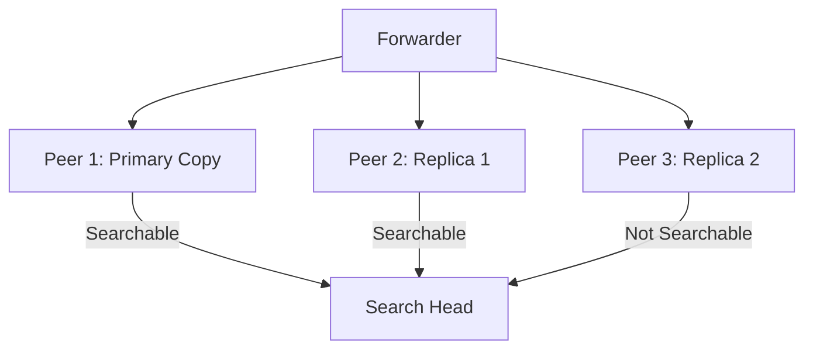
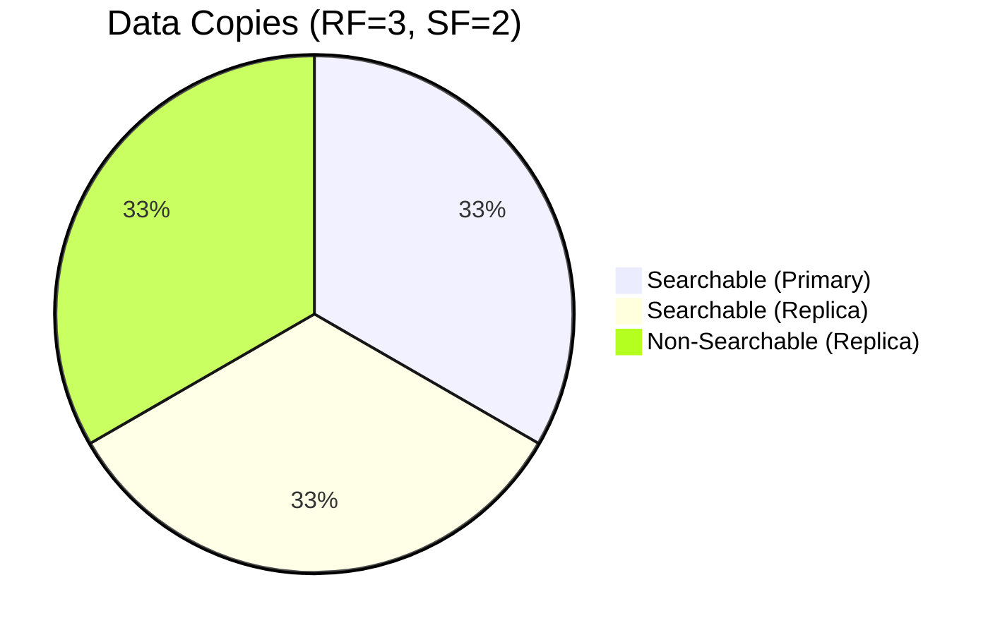
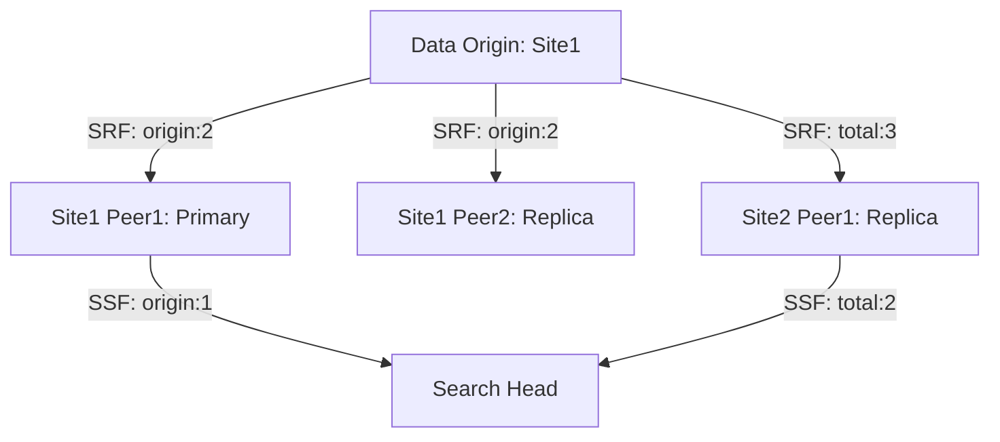
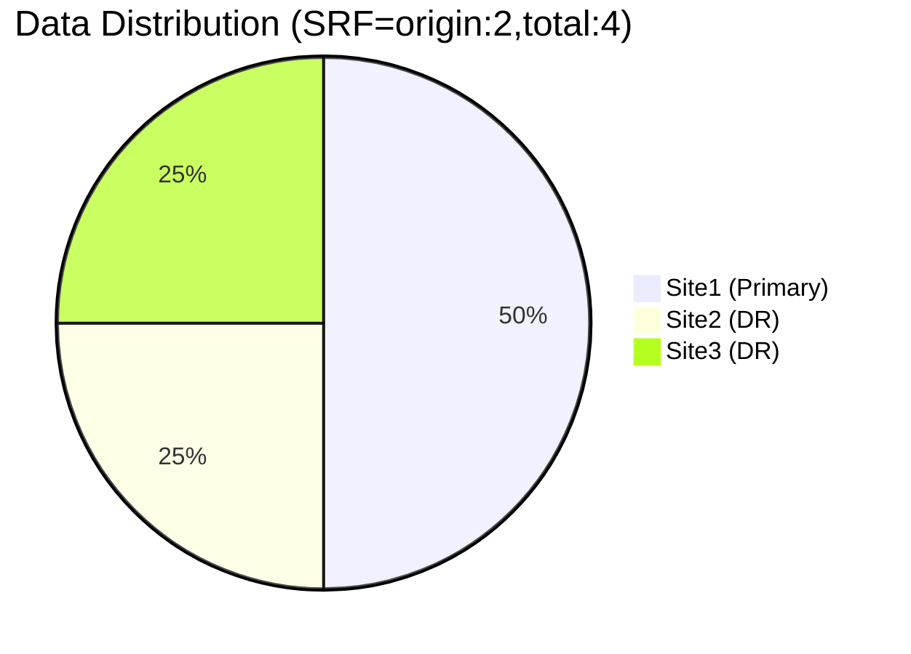

## **Search Factor** and **Replication Factor** work in Splunk indexer clustering:

---

## **Search Factor vs. Replication Factor**

|  | **Replication Factor (RF)** | **Search Factor (SF)** |
|--|----------------------------|------------------------|
| **Purpose** | Ensures data redundancy | Ensures searchable copies |
| **Controls** | How many copies of raw data exist | How many copies are searchable |
| **Minimum Value** | 1 | 1 |
| **Recommended** | 2-3 (for fault tolerance) | 2-3 (matches RF) |
| **Location** | Configured in `server.conf` | Configured in `server.conf` |

---

## **How They Work Together**

### **1. Data Flow Example (RF=3, SF=2)**


- **3 copies** exist (meets RF=3)
- **2 copies** are searchable (meets SF=2)
- 1 copy acts as **hot standby**

---

## **Key Mechanisms**

### **1. Bucket States**
| State | Searchable? | Counts Toward |
|-------|-------------|---------------|
| **Primary** | Yes | Both RF and SF |
| **Searchable Replica** | Yes | Both RF and SF |
| **Non-Searchable Replica** | No | Only RF |

### **2. Cluster Health Rules**
- **Red (Critical)**:
  - Any bucket has < RF copies
  - Any bucket has < SF searchable copies
- **Yellow (Warning)**:
  - All buckets meet RF but some have < SF searchable copies
- **Green (Healthy)**:
  - All buckets meet both RF and SF

---

## **Configuration Examples**

### **1. server.conf (Cluster Master)**
```ini
[indexer_clustering]
replication_factor = 3
search_factor = 2
```

### **2. CLI Commands**
```bash
# Check current status
splunk show cluster-status

# Modify factors (requires restart)
splunk edit cluster-config -replication_factor 3 -search_factor 2
```

---

## **Troubleshooting Commands**

### **1. Verify Bucket Status**
```bash
splunk list cluster-buckets -status
```
**Output Columns**:
- `Bucket ID`
- `State` (Primary/Replica)
- `Searchable` (yes/no)
- `Peer` (hostname)

### **2. Check Compliance**
```sql
index=_internal sourcetype=splunkd component=clustering 
| stats count by replication_count searchable_count
```

### **3. Force Repair**
```bash
splunk repair cluster-buckets -bucket <bucket_id>
```

---

## **Best Practices**

1. **Balanced Configuration**:
   - Always set **SF ≤ RF**
   - Recommended: `RF=3, SF=2` (optimal fault tolerance)

2. **Capacity Planning**:
   - Each replica consumes storage equal to original data
   - Example: 1TB raw data → 3TB storage needed (RF=3)

3. **Network Considerations**:
   - Ensure 10Gbps+ between peers for replication
   - <1ms latency for optimal performance

4. **Special Cases**:
   - **RF=1, SF=1**: No redundancy (dev only)
   - **RF=2, SF=1**: Data exists in 2 places, but only 1 searchable

---

## **Common Issues & Fixes**

| Problem | Symptoms | Solution |
|---------|----------|----------|
| **Under-replicated buckets** | `replication_count < RF` | Check peer network connectivity |
| **Unsearchable buckets** | `searchable_count < SF` | Verify indexer process health |
| **Split-brain** | Conflicting primaries | Manually designate captain |
| **Storage full** | Replication stalls | Add storage or peers |

---

## **Visualization of Factors**



This ensures:
- **Fault tolerance**: 2/3 peers can fail without data loss
- **Search availability**: 2/3 peers can serve searches
- **Load balancing**: Search heads distribute queries across searchable copies

---
---
---
## **Site Replication Factor**, **Site Search Factor**, and **Search Affinity** in Splunk's multi-site clustering:

---

## **1. Site Replication Factor (SRF)**
### **Purpose**
Controls how many copies exist **across different sites** (geographic locations)

### **Configuration**
```ini
# server.conf on Cluster Master
[clustering]
multisite = true
site_replication_factor = origin:2, total:3
available_sites = site1,site2,site3
```

### **Behavior**
| Scenario | Copies Distribution |
|----------|---------------------|
| **origin:2, total:3** | 2 copies in origin site + 1 copy in another site |
| **origin:1, total:2** | 1 local + 1 remote copy (minimum HA) |

### **CLI Command**
```bash
splunk edit cluster-config -site_replication_factor "origin:2,total:3"
```

---

## **2. Site Search Factor (SSF)**
### **Purpose**
Determines how many **searchable copies** exist per site

### **Configuration**
```ini
# server.conf on Cluster Master
[clustering]
site_search_factor = origin:1, total:2
```

### **Behavior**
| Scenario | Searchable Copies |
|----------|-------------------|
| **origin:1, total:2** | 1 searchable in origin site + 1 in another site |
| **origin:0, total:1** | All searches routed to remote site (DR scenario) |

### **CLI Command**
```bash
splunk edit cluster-config -site_search_factor "origin:1,total:2"
```

---

## **3. Search Affinity**
### **Purpose**
Controls which site's copies are **preferred for searching**

### **Configuration Options**
| Mode | Description | Config Example |
|------|-------------|----------------|
| **Local** | Prefer local site copies | `search_affinity = local` |
| **Remote** | Force remote site searches | `search_affinity = remote` |
| **None** | No preference (default) | `search_affinity = none` |

### **Implementation**
```ini
# server.conf on Search Heads
[clustering]
search_affinity = local
```

### **CLI Command**
```bash
splunk edit cluster-config -search_affinity local
```

---

## **How They Work Together**
### **Example Scenario (3 Sites)**


**Key Points**:
1. **SRF=origin:2,total:3**: Ensures 2 local copies + 1 remote
2. **SSF=origin:1,total:2**: 1 local + 1 remote copy searchable
3. **Search Affinity=local**: Queries try local copies first

---

## **Best Practices**
1. **SRF/SSF Ratio**:
   - Always set `SSF ≤ SRF` per site
   - Recommended: `SRF=origin:2,total:3` with `SSF=origin:1,total:2`

2. **Disaster Recovery**:
   ```ini
   # DR Configuration
   site_replication_factor = origin:1,total:2
   site_search_factor = origin:0,total:1
   ```

3. **Network Optimization**:
   - Set `search_affinity=local` to reduce cross-site traffic
   - Use `origin:n` values matching your WAN bandwidth

4. **Monitoring**:
   ```sql
   index=_internal sourcetype=splunkd component=clustering 
   | stats count by site replication_status searchable_status
   ```

---

## **Troubleshooting Commands**
### **1. Verify Site Factors**
```bash
splunk show cluster-status -sites
```

### **2. Check Search Affinity**
```bash
splunk btool clustering list search_affinity --debug
```

### **3. Force Site Rebalance**
```bash
splunk optimize cluster-buckets -site site1
```

---

## **Common Issues & Fixes**
| Issue | Diagnostic Command | Solution |
|-------|--------------------|----------|
| Cross-site latency | `ping <remote-site-peer>` | Adjust `search_affinity` |
| Incomplete DR copies | `splunk list cluster-buckets -site site2` | Increase SRF |
| Search timeout | `index=_internal "remote search timeout"` | Reduce SSF or upgrade WAN |

---

## **Visualization: 3-Site Deployment**


This ensures:
- **Local performance**: 2 searchable copies in primary site
- **Disaster recovery**: 2 additional copies in remote sites
- **Search efficiency**: Affinity keeps most queries local

